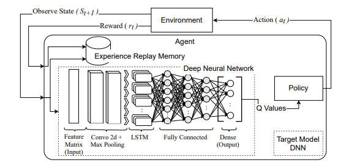

# Training the Speech-Emotion Recognition Model

Status: Not started

### Data Preprocessing

Audio files cannot be processed by any model as such, so we convert audio into other representational forms to access features. In order to model the speech, waves are utilized, which bear signals for emotions like happiness, sadness, disgust, fear, surprise, etc. We can first preprocess the audio to include noise reduction, normalization, and segmentation. This allows us to derive the audio signal, mel spectrum, chromas, etc.

### Data Augmentation

The available data can be replicated in multiple ways, such as adding noise, randomly shifting the sounds, stretching the sounds, and adjusting pitch and speed. This creates a more diverse dataset, allowing the model to be trained on a wider range of data.

 

### Feature extraction

We can determine important features, and identify the best ones that could uniquely define our audio signals. The mel spectrum and the chromas could be used to extract such features. Some important features that we found on the web were:

1. Zero Cross Rate
2. Energy
3. Entropy of Energy
4. Spectral Centroid
5. Spectral Spread
6. Spectral Entropy
7. Spectral Flux
8. Spectral Roll off
9. MFCC
10. Chroma Vector
11. Chroma Deviation

Referred article: [https://medium.com/heuristics/audio-signal-feature-extraction-and-clustering-935319d2225](https://medium.com/heuristics/audio-signal-feature-extraction-and-clustering-935319d2225)

### Model Training and Evaluation

There are many models that can yield the desired results. Some of them include k-clusters, pattern recognition models, LSTM, CNN, and building your own multi-layered perceptron neural network for classification, etc. The model that provides high accuracy and precision is often preferred. Research shows that a multilayered model that uses an LSTM layer, a CNN layer, and a dense FC layer yields good results. Research also indicates that using an MLP NN is a popular choice for building SER with high accuracies.

### Enhancements using RL

- For enhancing breaks while detecting emtions in a chunk of statement, we could use a pre-existing Emo-RL that uses deep RL to determine the best position to split the utterance to send to the emotion recognition model. The RL agent chooses to decide an “action” whether to wait for more audio data or terminate and trigger prediction. Once the terminate action is selected, the agent stops processing the audio stream and starts classifying the emotion.

- Using a RL to improve model using reward based system.

Souce: [https://arxiv.org/pdf/2101.00738](https://arxiv.org/pdf/2101.00738)
